# Пересменка — агрегатор детских кружков Петербурга

Поиск кружка в промежутке между концом уроков и концом рабочего дня. Родитель
задаёт три вещи — возраст ребёнка, окно в своём расписании и дорогу — и список
пересчитывается сразу, без кнопки «Найти».

Демонстрационный проект. Организации, филиалы, педагоги, цены и расписание
вымышлены; районы, станции метро и координаты — настоящие.

Чистые HTML, CSS и JS без сборщика и без единой зависимости. Генератор
каталога и генератор статических страниц — два скрипта на Node, тоже без
зависимостей.

Живой адрес: <https://peresmenka.vercel.app>

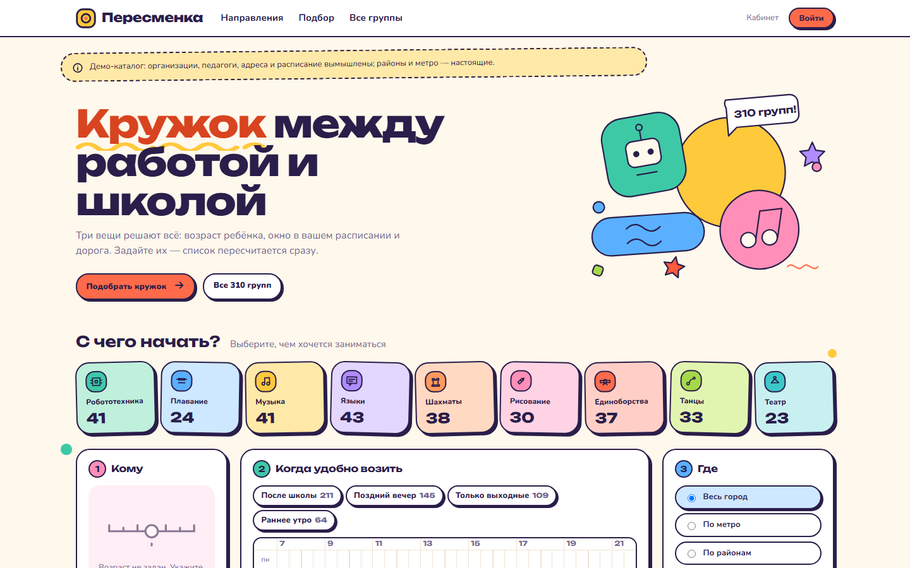

| Поиск: недельная сетка и окно под каждым занятием | Когда ничего не нашлось |
| --- | --- |
| 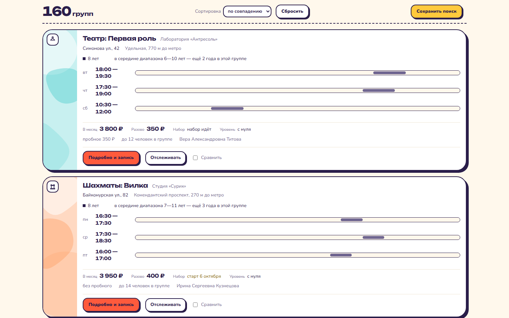 | 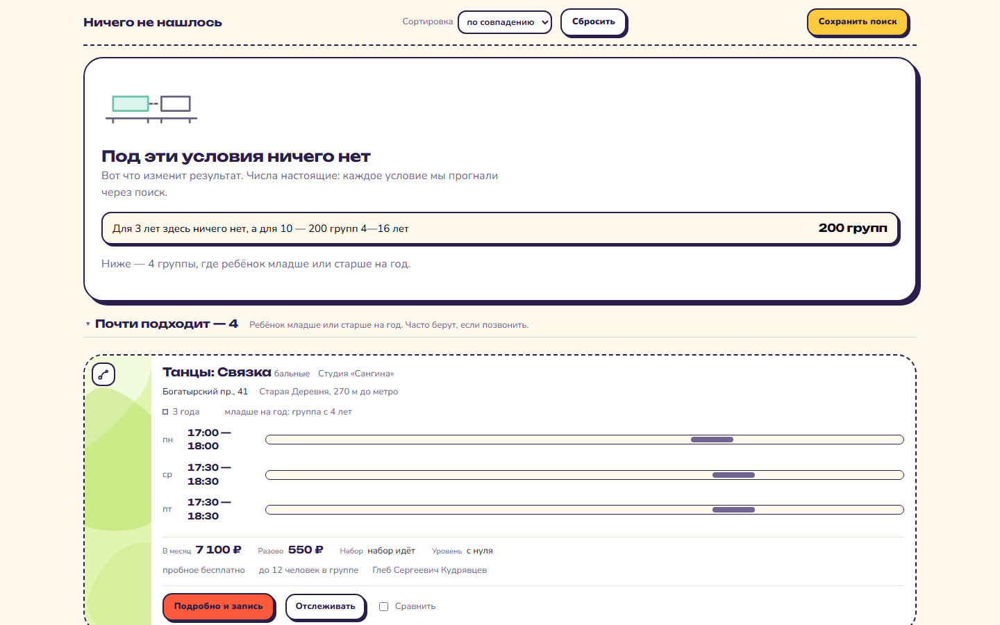 |

| Двое детей в одно время | Статическая страница под запрос |
| --- | --- |
| 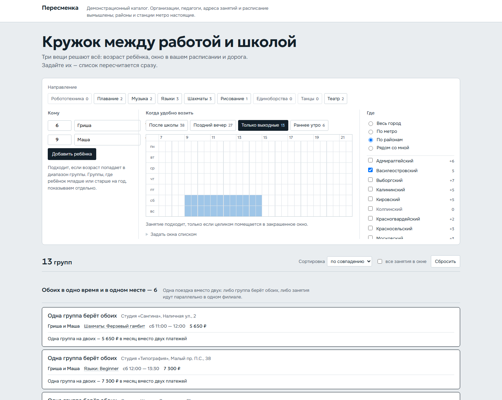 | 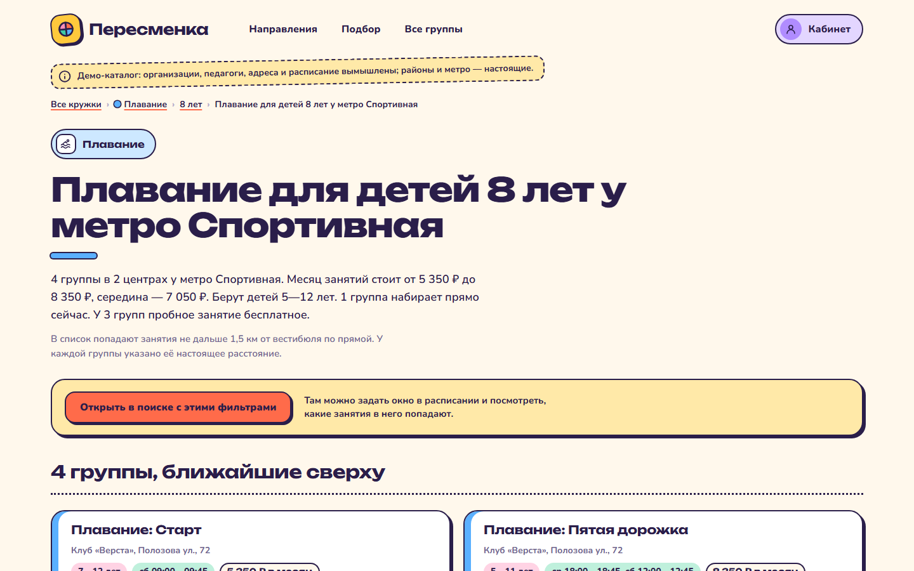 |

| Карточка группы | Телефон, 390 px |
| --- | --- |
| 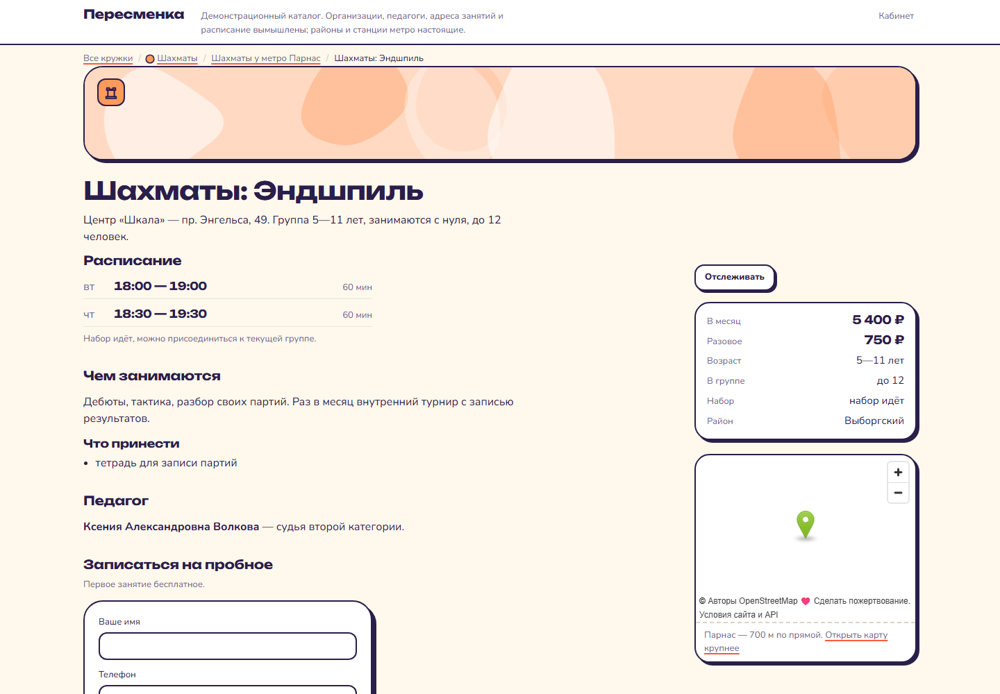 | 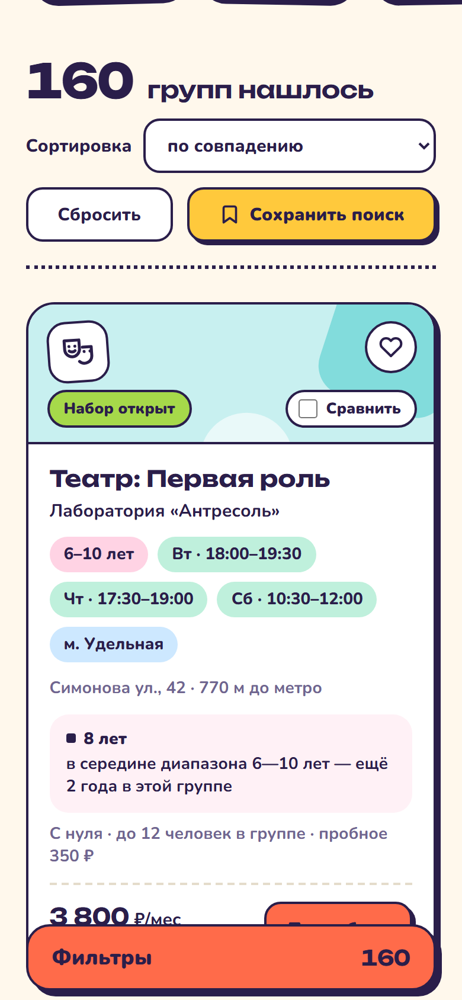 |

| Кабинет: заявки со стадиями | Уведомления |
| --- | --- |
| 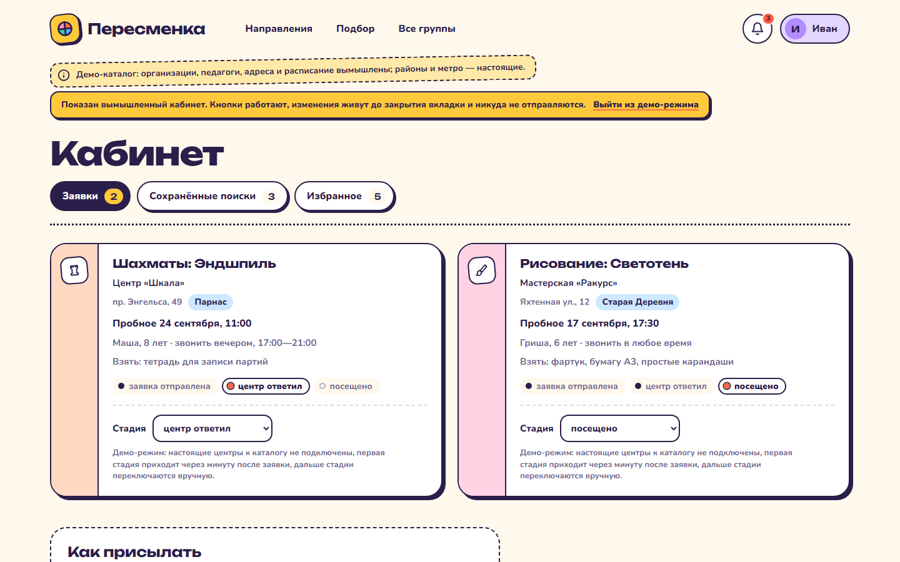 | 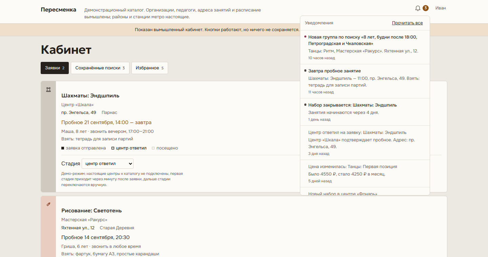 |

| Отслеживаемые группы | Вход: что он даёт |
| --- | --- |
| 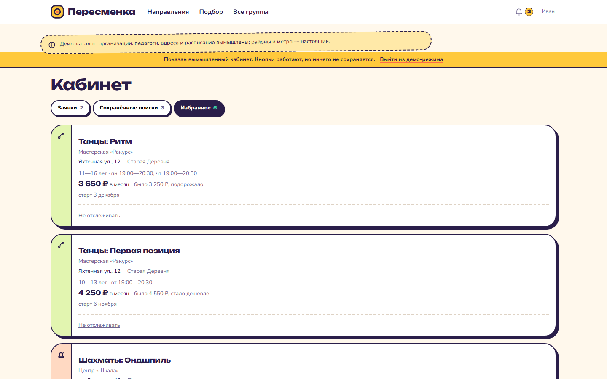 | 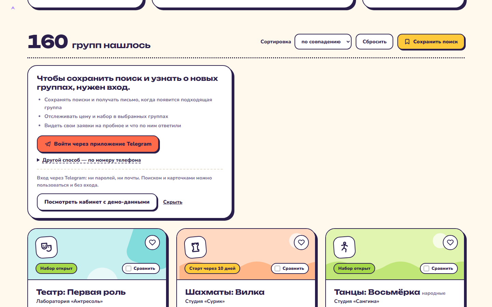 |

| Фильтры в шторке | Кабинет на телефоне |
| --- | --- |
| 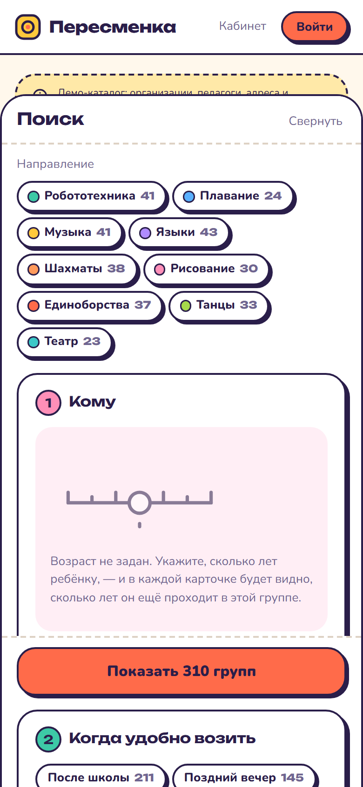 | 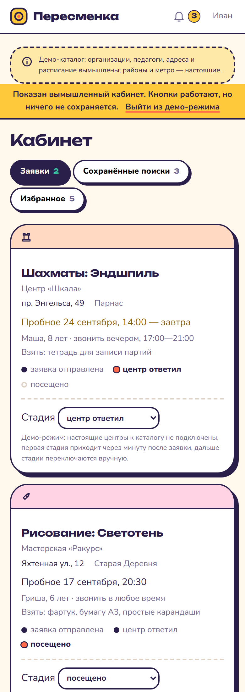 |

| Статическая страница под запрос на телефоне |
| --- |
| 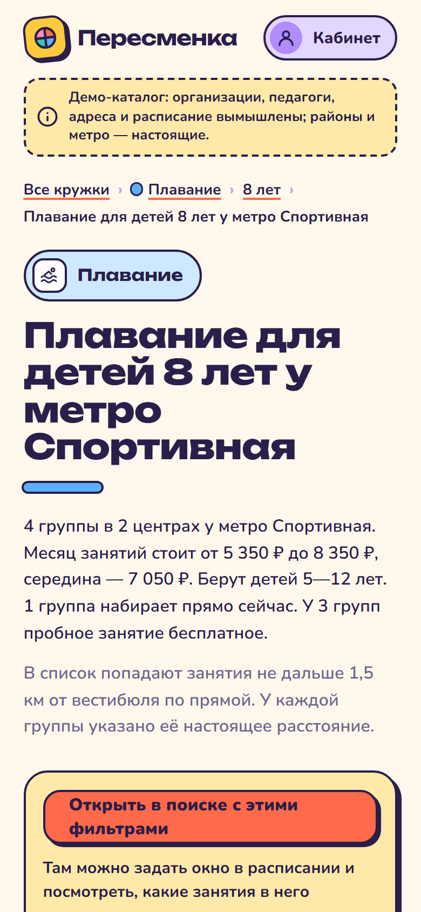 |

---

## Что внутри

**310 групп** в 72 филиалах 46 организаций. Единица каталога — конкретная
группа в конкретном месте, а не организация: у одного центра бывает несколько
филиалов, в каждом несколько групп разного возраста и расписания.

**779 статических страниц**, которые открываются без JavaScript: 9 по
направлениям, 104 по возрасту, 56 по районам, 300 по метро и 310 карточек
групп.

## Запуск

```bash
npm run build
```

Собирает каталог и статические страницы, печатает, сколько чего создано.

```bash
npm run serve
```

Поднимает локальный сервер на <http://localhost:5180>. Он повторяет поведение
хостинга: `/путь/` отдаёт `index.html` из каталога, а `/api/*` исполняет
функцию из `api/` так же, как это делает Vercel. Upstash и Telegram при этом
не нужны — см. раздел про кабинет.

Через `file://` сайт не заработает — скрипты подключены как ES-модули.

```bash
npm test
```

67 тестов на `node:test`: правило попадания занятия в окно, гаверсинус,
разбор URL, арифметика фасетов, честность подсказок, непротиворечивость
каталога, качество собранных страниц, проверка подписи Telegram, тихие часы
и владение объектами кабинета. Сеть не нужна ни одному. Тесты по страницам
пропускаются, если сборки ещё не было.

## Три фильтра

### Возраст

Группа подходит, если возраст попадает в её диапазон. В карточке пишем не
«7—10 лет», а сколько лет ребёнок ещё проходит в этой группе: «в середине
диапазона 6—11 — ещё 3 года», «хватит ещё на год, потом нужна группа старше»,
«последний год по возрасту».

Отдельным блоком — «почти подходит»: группы, где ребёнок младше или старше
ровно на год. Они не смешиваются с основным списком и не участвуют в
сортировке.

Если детей несколько, в карточке видно, кому из них подходит эта группа, а над
списком появляется блок «обоих в одно время и в одном месте»: либо одна группа
берёт обоих, либо две группы в одном филиале идут параллельно — родитель
приезжает один раз и ждёт один раз.

### Расписание

Состояние — маска 7 × 30 (пн—вс, 07:00—22:00, шаг 30 минут). Из неё выводятся
окна: непрерывные отрезки внутри дня.

Главное правило: **занятие подходит, только если целиком помещается в одно
окно.** Занятие 17:45—19:15 при окне «после 18:00» не подходит, потому что
родитель не заберёт ребёнка из школы раньше. Частичное пересечение — это не
«подходит», и в тестах это зафиксировано отдельно.

В карточке каждое занятие нарисовано полосой на шкале дня, а окно — заливкой
под ней. Видно не «да/нет», а на сколько минут занятие вылезает. Если из трёх
занятий в неделю в окно попадает одно, так и написано.

Редакторов у маски два, и оба равноправны: недельная сетка с протяжкой мышью
(на экранах от 768 px) и список «дни + не раньше + не позже». Список — это и
мобильный интерфейс, и текстовая альтернатива сетки для скринридера. Протяжка
пальцем по ячейке шириной 11 px не работает, поэтому на узком экране сетки нет
совсем, а не «сжатая версия».

### География

Три режима: по районам, по метро (сгруппировано по линиям), «рядом со мной» —
по геолокации браузера, по введённому адресу или по координатам, с радиусом.

Расстояние считается по прямой (гаверсинус) и подписывается честно: «1,2 км по
прямой». Никаких обещаний про время в пути.

Геокодера нет и не может быть без бэкенда, поэтому адрес ищется по локальному
справочнику: 69 станций метро и полсотни ориентиров и улиц из `data/geo.json`.
Так и подписано. Принимаются и координаты вида `59.955, 30.29`.

Если в геолокации отказали, сайт один раз говорит об этом и предлагает
выбрать метро. Повторно не спрашивает.

## Цвет и графика

Цвет на сайте принадлежит содержанию, а не интерфейсу. Девять направлений —
девять материалов: зелёный текстолит платы у робототехники, вода у плавания,
латунь у музыки, чернила у языков, графит у шахмат, сангина у художественной
школы, солома татами у единоборств, бордо кулис у танцев, сливовый бархат
у театра. Цвет направления работает в плитке на первом экране, на обложке
карточки, в точке хлебных крошек и в заголовке посадочной страницы. В кнопках,
ссылках, тексте, панели результатов и сетке недели его нет никогда.

Палитра лежит в одном месте — в `css/app.css` под `[data-dir="…"]`. Разметка
её не знает: SVG берёт `var(--d-ink)` и `var(--d-wash)`, пиктограммы —
`currentColor`. Рассинхронизировать цвет между поиском и статикой нечем.
Все девять проверены: чернила дают ≥4,5:1 на бумаге, на листе и на собственной
заливке.

Служебных акцентов ровно два, и оба про время: **синий** — окно, которое задал
родитель, **янтарный** — то, что поджимает (занятие вылезло за окно, старт
в ближайшие две недели). «Набор идёт» к этому не относится и остаётся
нейтральным. Возраст ±1 — мягкая граница, где решает звонок в центр, поэтому
она показана полым маркером и пунктиром, а не третьим оттенком.

**Пиктограммы** нарисованы под одно ограничение: сетка 24×24, обводка 1,75,
только горизонтали, вертикали, диагонали под 45° и окружности. Дуга на девять
знаков ровно одна — у танцев, где она значит движение. Ни персонажей, ни масок,
ни глобусов.

**Обложки** карточек строятся из id группы. Случайная маска дала бы шум,
поэтому клетка закрашивается арифметическим правилом `(a·c + b·r) mod m < t`:
выходят диагонали, шахматка, разреженная решётка, муар — но никогда каша.
Сетка задаётся размером клетки, а не числом колонок, поэтому один и тот же
рисунок одинаково читается и на полосе карточки 88×240, и на ленте страницы
группы 960×120. На 310 групп — 310 разных обложек, минимум шесть фигур
в каждой. Фотографий детей нет нигде.

Всё это инлайновый SVG в `js/visual.js` — ни одного файла картинки, ни одной
зависимости.

## Счётчики у фильтров

Одно правило на весь сайт, чтобы числа нигде не противоречили друг другу:

| ситуация | что показывает число |
| --- | --- |
| в фасете ничего не выбрано | сколько будет, если выбрать только это |
| в фасете уже что-то выбрано | сколько **добавится**, если выбрать ещё и это (`+4`) |
| опция выбрана | сколько результатов держится на ней |

Панель пустого результата пользуется той же функцией, поэтому «+4» у чекбокса
и «ещё 4 группы» в подсказке — это один и тот же вызов.

## Когда ничего не нашлось

Пустой экран разбирает, какой фильтр всё отсёк, и предлагает по одному
послаблению на фильтр: сдвинуть окно, взять соседнюю станцию, попробовать
соседний возраст, снять направление. Под каждое предложение реально
прогоняется полный фильтр, и показывается настоящее число. Предложения,
которые ничего не дают, не показываются вовсе. Тест `каждая подсказка обещает
столько, сколько реально даёт` проверяет это на живых данных.

Если соседние станции не помогают, а результат пуст, сайт ищет ближайшую
станцию, где искомое вообще есть: «Ближайшее место, где это есть, —
„Чкаловская", 1,3 км отсюда».

## Состояние в URL

Фильтры живут в query string, ссылку можно переслать, «назад» ходит по шагам.

```
/?dir=shahmaty&kids=8,6&kn=Маша,Гриша&win=12345:1080-1320|6:540-780
 &strict=1&geo=metro&m=chkalovskaya,sportivnaya&sort=price
```

Окна пишутся группами дней с одинаковым отрезком, иначе ссылка распухает.
`pushState` — на завершённое изменение (отпустили кнопку мыши, кликнули
чекбокс), `replaceState` — на ввод имени и перетаскивание радиуса.

## Статические страницы

```bash
npm run pages
```

`tools/build-seo.mjs` импортирует тот же `js/model.js` и тот же `js/render.js`,
что и браузер, поэтому числа и разметка на статической странице не могут
разойтись с поиском.

### Адреса

```
/shahmaty/                          направление
/shahmaty/8-let/                    направление + возраст
/shahmaty/sportivnaya/              направление + метро
/shahmaty/8-let/sportivnaya/        всё вместе
/shahmaty/rayon-petrogradskiy/      направление + район
/g/g042-shahmaty-tura-chkalovskaya/ карточка группы
```

### Два правила отбора

**Порог 3.** Страница не создаётся, если под неё меньше трёх групп. Пустые
страницы под запросы вредят, а не помогают.

**Отсев близнецов.** Порог не спасает от другой беды: Пушкинская и
Звенигородская — это 400 метров, и состав групп у них почти одинаковый.
Кандидаты одного (направление, возраст) сортируются по числу групп, и если
состав новой страницы пересекается с уже созданной по Жаккару на 80% и больше,
страница не создаётся. Пересадочные узлы схлопываются сами, руками список не
ведётся. На текущих данных так отсеивается 286 страниц из 586 кандидатов.

По возрастам близнецы не ищутся намеренно: `/shahmaty/7-let/` и
`/shahmaty/8-let/` могут собрать один и тот же список, но каждая группа на них
описана относительно своего возраста — это разные страницы по содержанию.

### Почему «метро» — это радиус

Если считать станцией только ближайшую к филиалу, флагманский запрос вида
«шахматы для детей 8 лет на Спортивной» набирает три страницы на весь сайт.
Замеры на текущих данных, порог 3:

| правило | `/dir/N-let/metro/` |
| --- | --- |
| станция = ближайшая, возраст = точное совпадение | 3 |
| станция = ближайшая, возраст = попадание в диапазон | 157 |
| радиус 1,2 км, возраст = попадание в диапазон | 185 |
| **радиус 1,5 км, возраст = попадание в диапазон** | **231** |

В зону станции попадает всё, что не дальше 1,5 км по прямой, и это подписано
на самой странице, а у каждой группы стоит её настоящее расстояние до этой
станции.

### Что на каждой странице

Уникальные `title` и `description` с подставленными числами (тест ловит любые
два совпадения дословно), вводный абзац из данных, список групп прямо в HTML,
перелинковка на соседний возраст, соседние станции и другие направления,
хлебные крошки, `canonical`, разметка `BreadcrumbList` + `ItemList` + `Course`,
кнопка «Открыть в поиске с этими фильтрами».

Плюс `sitemap.xml` и `robots.txt`.

## Карточка группы

Расписание, цена за месяц и разовая, педагог, чем занимаются, что принести,
карта OpenStreetMap с меткой по координатам (грузится лениво, ключ API не
нужен), расстояние до метро, ссылки на другие группы в этом филиале и на то же
направление рядом.

Форма записи на пробное отправляет заявку через `sendLead(data)` в
`js/lead.js`. Сейчас функция пишет в консоль и возвращает успех — на её место
встаёт запрос к своей функции, остальной код формы от этого не зависит.

## Как добавить группу в данные

`data/catalog.json` **перезаписывается на каждой сборке** — править его руками
бессмысленно. Ручные записи живут в `data/extra.json` и подмешиваются
генератором после всего остального:

```json
{
  "orgs": [{ "id": "o90", "name": "Клуб «Пример»", "shortName": "Пример" }],
  "branches": [{
    "id": "b900", "orgId": "o90",
    "address": "Гатчинская ул., 5",
    "districtId": "petrogradskiy", "districtName": "Петроградский",
    "stationId": "chkalovskaya", "stationName": "Чкаловская",
    "metroDistance": 400, "lat": 59.9612, "lon": 30.2955, "hasPool": false
  }],
  "groups": [{
    "id": "g900", "slug": "shahmaty-primer-chkalovskaya",
    "direction": "shahmaty", "subtype": null, "title": "Пример",
    "orgId": "o90", "branchId": "b900",
    "ageFrom": 7, "ageTo": 11, "level": "start",
    "lessons": [{ "day": 2, "start": 1080, "end": 1140 }],
    "priceMonth": 4200, "priceSingle": 700,
    "trial": { "has": true, "free": true },
    "teacher": { "name": "Имя Отчество Фамилия", "note": "ведёт группы третий год" },
    "groupSize": 8, "intakeStart": "2026-10-01",
    "about": "Чем занимаются.", "brings": ["тетрадь"]
  }]
}
```

Время — минуты от полуночи (`1080` = 18:00), день недели — 1 (понедельник) …
7 (воскресенье). Id не должен совпадать с уже существующим, иначе генератор
пропустит запись и скажет об этом. Организацию и филиал можно не добавлять,
если ссылаетесь на существующие.

После правки — `npm run build`.

### Перегенерация каталога

`tools/gen-data.mjs` детерминирован: при том же сиде (`SEED` в начале файла)
получаются те же id, те же адреса и те же цены. Недетерминированы только даты
набора — они считаются от дня сборки, чтобы каталог не показывал прошлогодний
набор: 45% групп уже набирают, 40% стартуют в ближайшие 45 дней, 15% в
следующем полугодии.

Поменяйте `SEED` — получится другой город с той же статистикой.

## Деплой на Vercel

`vercel.json` уже настроен: `buildCommand` запускает `npm run build`,
`outputDirectory` — корень, `trailingSlash` включён.

```bash
npx vercel --prod
```

Дальше пуш в `main` разворачивается сам. Генерируемые каталоги (`/g/`,
`/shahmaty/` и прочие) в git не попадают — их создаёт сборка.

## Доступность

- Фильтры полностью управляются с клавиатуры. В сетке: стрелки водят курсор,
  пробел красит ячейку, `Shift` + стрелка тянет окно, `Home` / `End` — к краям
  дня. Внутри сетки один tabstop (roving tabindex), а не 210.
- У сетки есть текстовая альтернатива — тот же список окон, которым правят
  с телефона, плюс `aria-live` со словесным описанием выбранного.
- Число результатов объявляется через `aria-live="polite"`.
- Видимый фокус: сплошная рамка в 2 px со смещением, нигде не отключён.
- Приглушённые нулевые опции сохраняют контраст не ниже 4,5:1 — их видно
  и по ним можно кликнуть.
- `prefers-reduced-motion` убирает выезд шторки и переходы. Появлений блоков
  при скролле нет вообще: движение только в ответ на действие.

## Кабинет и уведомления

Вход нужен ровно для трёх вещей: сохранить поиск, отслеживать группу и видеть
свои заявки. Всё остальное — поиск, карточки групп, 779 статических страниц —
работает без входа и без единой модалки «войдите, чтобы продолжить». Гость,
нажавший «Сохранить поиск», видит панель с объяснением прямо под результатами;
поиск под ней продолжает работать.

Статические страницы-списки при этом не получили ни одного исполняемого
скрипта: там по-прежнему только JSON-LD и обычная ссылка `<a href="/lk/">`.
Это стерегут два теста, которые проходят по всем 369 страницам и падают
от любого `<script src>` и любого инлайнового `on*`.

### Вход

Входов два, оба через Telegram, и оба кончаются одинаково: `registerUser`
и обычная сессия. Ни паролей, ни почты.

**Через приложение — основной.** Браузер в опознании не участвует вовсе:

```
сайт     POST /api/auth/link/          заявка: одноразовый nonce
                                        и код сверки из четырёх знаков
человек  t.me/<бот>?start=<nonce>      «Запустить» в приложении
Telegram POST /api/tg/webhook/         кто это, сообщает сам мессенджер
бот      кнопка «Подтвердить · КОД»    код сверяется глазами с экраном
сайт     GET /api/auth/link/?nonce=…   опрос раз в две секунды, в ответ сессия
```

Зачем он, если есть виджет: `oauth.telegram.org` просит номер и шлёт
подтверждение служебным сообщением, а оно доходит не до всех номеров.
Здесь этого шага нет — есть только обычное сообщение от бота.

Опасность у схемы одна, и она обратная фишинговой: злоумышленник заводит
заявку у себя и подсовывает жертве свою ссылку. Поэтому нажатие «Запустить»
сессию ещё не выдаёт. Нужна вторая кнопка, а на ней написан код, который
виден только на экране того, кто вход начал: не совпало — «Это не я»,
и заявка уничтожается. Заявка живёт 10 минут, одноразовая, `/start` по ней
принимается один раз, а подтвердить может только тот, кто этот `/start`
и прислал — `id` берётся из обновления Telegram, а не из данных кнопки.

Адрес вебхука открыт всему интернету, поэтому закрыт секретом: Telegram
шлёт его заголовком `X-Telegram-Bot-Api-Secret-Token`. Сверка постоянная
по времени, а незаданный секрет означает «закрыто», а не «пускать всех».

**Виджет по номеру — запасной**, убран под «другой способ»; скрипт
telegram.org грузится, только если этот способ раскрыли. Подпись проверяется
на сервере:

```
data_check_string = поля кроме hash, отсортированы, склеены переводом строки
secret_key        = sha256(BOT_TOKEN)              ← байты, не hex
подпись           = hmac_sha256(data_check_string, secret_key)
сверка            = timingSafeEqual, не ==
срок              = auth_date не старше суток и не из будущего
```

Сессия в обоих случаях — httpOnly-кука `ps_session` на 90 дней,
`SameSite=Lax`, `Secure` на боевом домене. Право боту писать первым
у виджета берётся из `data-request-access="write"`, а при входе через
приложение возникает само: человек нажал Start, то есть написал боту первым.

**Владение обеспечено устройством ключа, а не проверкой в коде.** `uid`
берётся только из сессии; поля пользователя в теле запроса нет вообще, так что
подставить чужой id некуда. Тест `id пользователя в теле запроса игнорируется`
делает это буквально: посылает `uid`, `user_id` и `userId` от чужого имени
и проверяет, что запись ушла тому, чья кука.

### Разделы

**Заявки.** Группа, дата и время пробного, адрес, что взять, стадия. Стадии
показаны формой маркера, а не цветом: пройденные залиты, текущая полая.
Первая стадия («центр ответил») приходит через минуту после отправки —
чтобы было видно, что механика живая. Дальше стадии переключаются вручную,
и это подписано: настоящие центры к демо-каталогу не подключены.

**Сохранённые поиски.** Имя собирается из самих фильтров функцией
`describeQuery`: «8 лет, будни после 18:00, Петроградская». Своё имя, если
его задать, побеждает. Число «сейчас подходит» считается при открытии
кабинета, а не хранится рядом с фильтрами — сохранённое через неделю врёт.

**Избранное.** В хранилище лежит только id группы и снимок цены с датой
набора на момент добавления; всё остальное берётся из каталога при каждом
чтении. Снимок и есть механизм события «цена изменилась».

### События

Шесть, и каждое агрегатор умеет вычислить по своим данным:

| событие | чем вычисляется |
| --- | --- |
| по сохранённому поиску появилась новая группа | прогон `js/model.js`, разница с `seen_ids` |
| пробное завтра | дата заявки, адрес и «что взять» из каталога |
| центр ответил на заявку | смена стадии |
| в отслеживаемой группе изменилась цена | сравнение со снимком |
| в отслеживаемой группе закрывается набор | дата старта в ближайшие 7 дней |
| открылся новый набор там, где вы что-то отслеживаете | новая группа в организации из избранного |

Чего здесь нет и не будет: пропусков, посещаемости, оплаты обучения — этих
данных у агрегатора нет. По той же причине выброшено «осталось мало мест»:
в каталоге есть вместимость группы, но сколько в неё уже записались, центры
никому не сообщают. Придумывать число нельзя.

Отдельной подписки на центр тоже нет: «знакомый центр» — это тот, где вы уже
что-то отслеживаете. Вторая сущность ради одного события не нужна.

### Доставка

Два канала, включаются раздельно: колокольчик в шапке и сообщение в Telegram
тем же ботом, через который вход. Тихие часы (по умолчанию 22:00–08:00
по Петербургу) действуют только на Telegram: в интерфейсе уведомление
появляется сразу, отправка откладывается до восьми утра полем `send_after`
и дошлётся ближайшим запуском крона. Если человек не нажимал в боте «Запустить»,
Telegram вернёт 403 — канал помечается недоступным, и в кабинете появляется
строка о том, что нужно сделать, а не молчаливая потеря уведомления.

### Демо-режим

`/lk/?demo=1` — заполненный кабинет вымышленного человека: две заявки, три
поиска, пять отслеживаемых групп, шесть уведомлений. Ни одного обращения
к API, изменения живут в памяти вкладки и исчезают при перезагрузке; сверху
тонкая плашка, которая так и говорит. Заготовка собирается из настоящего
каталога скриптом `tools/gen-demo-account.mjs`, поэтому все id, адреса
и расписания существуют.

### Хранилище

Upstash Redis по REST, без единой зависимости — хватает `fetch`. Коллекции
кабинета лежат целыми JSON-массивами: весь кабинет читается четырьмя
запросами вместо N+1.

Рядом с каждым массивом хранится номер версии, а запись идёт скриптом, который
сверяет версию на стороне Redis и возвращает отказ, если она изменилась.
Тогда клиент перечитывает и повторяет. Так две вкладки одного человека
не затирают правки друг друга.

Если переменные Upstash не заданы, клиент работает в памяти процесса. Это
не тихий фолбэк вместо ошибки, а режим для локального запуска: `npm run serve`
поднимает сайт вместе с функциями и без облака, и тесты идут так же.

### Локально

```bash
npm run serve
```

Поднимает и статику, и функции: `/api/*` исполняется тем же способом, что
на Vercel. Хранилище при этом в памяти, Telegram не нужен — весь кабинет
проверяется через демо-режим и через тесты.

Переменные сервер подхватывает сам из `.env.local` или `.env`, если такой
файл рядом есть: забытый `--env-file` выглядит как «кабинет сломался», хотя
дело в пустом окружении. Заданное снаружи не перетирается.

```bash
npm test
```

82 теста. Из них по кабинету: девять на подпись виджета (правильная проходит,
подделка любого поля не проходит, чужой токен не проходит, протухший
и будущий `auth_date` не проходят), пятнадцать на вход через приложение
(секрет вебхука, перехват заявки вторым Start, чужое подтверждение,
одноразовость, частота), четыре на тихие часы с границами, пять на имена поисков
и одиннадцать на владение объектами.

### Настройка Telegram

1. У @BotFather создать бота и взять токен → `TELEGRAM_BOT_TOKEN`.
2. Там же `/setdomain` и указать домен сайта, например `peresmenka.vercel.app`.
   **Без этого кнопка входа просто не отрисуется** — виджет проверяет домен.
3. Имя бота без `@` положить в `TELEGRAM_BOT_USERNAME`: его отдаёт `/api/me`,
   и по нему страница собирает и виджет, и ссылку на бота.
4. Придумать секрет вебхука и положить в `TELEGRAM_WEBHOOK_SECRET`:

   ```bash
   node tools/set-webhook.mjs --secret
   ```

5. Привязать вебхук — после того, как переменная попала и в `.env`, и на Vercel:

   ```bash
   node --env-file=.env tools/set-webhook.mjs
   ```

   Проверить потом: тот же файл с `--info`, отвязать — с `--delete`. Адрес
   вебхука ставится **со слэшем на конце**: за редиректом Telegram не ходит,
   а `trailingSlash` без слэша отдаёт 308.

   Если команда упала таймаутом, а Telegram у вас открывается через
   локальный прокси — `fetch` в Node не берёт `HTTPS_PROXY` из окружения,
   в отличие от curl. Тогда так:

   ```bash
   node --use-env-proxy --env-file=.env tools/set-webhook.mjs
   ```
6. В Upstash создать базу и взять REST URL и токен.
7. Придумать `CRON_SECRET`: без него `/api/cron/match` отвечает 401.

Все переменные перечислены в `.env.example`. На Vercel они задаются
в Settings → Environment Variables.

Адреса функций пишутся **со слэшем на конце**: в `vercel.json` включён
`trailingSlash`, и без него каждый запрос получает 308 и идёт в два захода.
`CRON_SECRET` должен быть из латиницы и цифр — Vercel отправляет его
заголовком и отказывается собирать проект, если там кириллица.

Проверить, какое хранилище подключено на самом деле:

```bash
curl -s https://peresmenka.vercel.app/api/me/
```

Поле `store` скажет `upstash` или `memory`. Если `memory`, переменные Upstash
не доехали, и кабинет будет терять данные между запросами.

`store: upstash` ещё не значит, что всё хорошо. В консоли Upstash рядом лежат
два REST-токена, и если взять тот, что **только для чтения**, сайт выглядит
рабочим: каталог открывается, `/api/me` отвечает, а любая запись падает с 403.
Поэтому перед деплоем стоит прогнать проверку — она начинает с записи:

```bash
node --env-file=.env tools/check-upstash.mjs
```

Крон настроен в `vercel.json` и ходит раз в сутки в 6 утра UTC. Его же можно
дёрнуть руками:

```bash
curl -H "Authorization: Bearer $CRON_SECRET" https://peresmenka.vercel.app/api/cron/match/
```

## Устройство кода

```
index.html              поиск (единственная страница, которой нужен JS)
css/app.css             токены, поиск, карточка
css/page.css            статические страницы
js/model.js             фильтры, гаверсинус, фасеты, подсказки — без DOM
js/format.js            числа, даты, склонения — без DOM
js/render.js            HTML карточки строками — без DOM
js/state.js             URL ↔ состояние — без DOM
js/grid.js              недельная сетка и её список-двойник
js/app.js               оркестратор: контролы, результаты, сравнение, шторка
js/lead.js              форма записи и кнопка «Отслеживать»
js/account.js           клиент кабинета: живой API и демо-заготовка
js/topbar.js            профиль, колокольчик, панель входа
js/lk.js                страница кабинета
js/describe.js          имя сохранённого поиска из фильтров
lk/index.html           кабинет (noindex, вне sitemap)
api/_lib/               сессия, Upstash, Telegram, заявки на вход — общее
api/*.mjs               вход, кабинет, поиски, избранное, заявки, уведомления
api/auth/link.mjs       вход через приложение: сторона сайта
api/tg/webhook.mjs      вход через приложение: сторона Telegram
api/cron/match.mjs      сопоставитель: тот же model.js, что и в браузере
tools/gen-data.mjs      генератор каталога (сид фиксирован)
tools/gen-demo-account.mjs  заготовка демо-кабинета
tools/build-seo.mjs     генератор статических страниц
tools/serve.mjs         локальный сервер
tools/set-webhook.mjs   привязка вебхука бота, один раз на домен
tools/check-upstash.mjs проверка базы перед деплоем
data/geo.json           районы, линии, 69 станций, ориентиры — вручную
data/catalog.json       каталог — генерируется
data/extra.json         ручные дополнения к каталогу
```

Четыре модуля из девяти не знают про DOM вообще — именно их импортирует Node
на сборке. Это не архитектурная красота ради красоты: если бы статические
страницы считали цены и расстояния своим кодом, они бы разошлись с поиском
на первой же правке.

## Чего здесь нет

- Фреймворков, сборщиков и зависимостей — ни одной.
- Бэкенда у поиска: 310 групп фильтруются в браузере за доли миллисекунды
  (полный пересчёт всех 69 фасетов метро — 1,1 мс). Серверные функции нужны
  только кабинету, и без входа не выполняется ни одна.
- Обещаний про время в пути, дорисованных карт-заглушек и слова «примерно»
  там, где можно посчитать точно.
